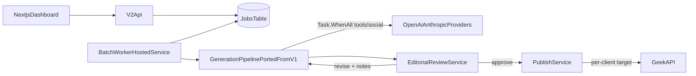

<!-- 670425f1-8725-4f8c-a694-ed646feb6220 -->
> **SUPERSEDED — kept for history, do not follow.** This doc describes the original content-writer-v2 architecture (a separate repo), which has since pivoted on the points below. Read this before anything else in this file.
>
> - **No database, no EF Core, no repository pattern in content-writer-v2.** State lives in a plain in-process object store, for the process lifetime only. This isn't a stopgap or a preference — two earlier database-backed designs for storing/serving content were tried and vetoed because they couldn't support the fine-grained per-element access this pipeline needs (e.g. `entry.sections[1].heading` in this repo's `content-page.tsx`, moving to a flat `entry.blocks[n]`). Relational/nested DB storage fought that access pattern; file-based export doesn't.
> - **"Markdown export — retired" below is wrong — it's the opposite.** `.html` export (migrated from `.mdx` — the body was always raw HTML, `.mdx` was a misnomer), committed directly into *this* repo's `content-writer-output/` via GitHub's Git Data API, is now content-writer-v2's entire persistence mechanism. It supersedes the GeekBackend-publish flow this doc describes throughout.
> - **The GeekBackend-publish path (Phase 3/4 below) was descoped, then the publish consumer itself was deleted** in content-writer-v2. This repo (`content.ts`/`content-page.tsx`) only ever reads `.html` files already committed here (with a `.mdx` fallback for not-yet-regenerated legacy files) — it never talks to content-writer-v2's API or any database.
> - **Content schema is moving from a nested `sections[]` tree to a flat `blocks[]` array** as the frontmatter shape of exported `.html` — every heading/paragraph/list/etc. individually addressable, no remainder content requiring a fallback renderer.
---
todos:
  - id: "v2-skeleton"
    content: "Scaffold content-writer-v2 repo, port v1 backend code (Postgres-only), initial migration, deploy skeleton to new Railway project"
    status: pending
  - id: "v2-clients"
    content: "Add Client + PublishTarget entities, ClientId on Project, seed Geek At Your Spot client"
    status: pending
  - id: "v2-batch"
    content: "BatchJob/BatchJobItem + BackgroundService worker with resumable per-step pipeline and batch API endpoints"
    status: pending
  - id: "v2-parallel"
    content: "Parallelize tool pages and social posts within a project; concurrency caps across projects"
    status: pending
  - id: "v2-review"
    content: "EditorialReviewService with rubric, ReviewVerdict storage, automatic revise-until-approved loop, publish gate"
    status: pending
  - id: "v2-frontend"
    content: "Next.js dashboard: clients, batch submit, progress board, review activity log, publish log"
    status: pending
  - id: "v2-decisions-doc"
    content: "DECISIONS.md in v2 repo recording vetoed/retired proposals (ContentFigures image model, markdown export, NewsArticle status) with rationale"
    status: pending
  - id: "v2-verify"
    content: "Verify GeekAPI draft support, end-to-end draft-publish vs v1 with defined acceptance criteria, unattended batch test, resumability test, cost + review-convergence data"
    status: pending
isProject: false
---
# Content Writer v2 — Standalone Batch-First Rewrite

## Ground rules

- New repo `content-writer-v2`, new Railway project with its own Postgres. v1 (`~/development/content-writer`, Railway "ContentWriter") keeps running untouched.
- Port, don't rewrite: the proven v1 generation code (crawler, prompts, generators incl. today's ToolPageGenerator, publish client) is copied over and adapted. Productivity over purity.
- Same stack as v1 (.NET 10 API + EF Core/Postgres, Next.js frontend) so code ports cleanly. Local ports 5052 (API) to avoid clashing with v1's 5051.
- v2 publishes to the same GeekBackend `api/blog` — publish target (URL + API key) becomes per-client config instead of a single global option.
- Fork point is pinned: copy v1 code only after any in-flight v1 fixes are merged, so v2 does not inherit bugs already fixed once.

## Recorded decisions (documented, not dogma)

These are decisions with rationale, recorded in a `DECISIONS.md` in the v2 repo — phrased as "proposed and vetoed/retired for this pipeline," not as absolute bans, since client work may legitimately revisit them:

- **Markdown export — retired.** v1's `ContentMarkdownExportService`/YAML-frontmatter flow was replaced by direct publish to GeekBackend. Not ported to v2; documented as retired with the reason (publish API superseded it).
- **ContentFigures image model — proposed and vetoed.** Content Writer's scope ends at generating **image prompts** (one per `<h2>` section and its paragraphs), stored as plain content rows with no status/lifecycle/`ImageUrl` tracking. Image generation and image state belong to a standalone consumer reading prompts over the HTTP API — no DB coupling. Rename any ported "figure" naming to "image prompt" so the old status model doesn't creep back in.
  - **Status (2026-07-17): built.** The consumer is `image-generator` (`~/development/image-generator`, Next.js, `POST /api/generate`) — takes a finished prompt + `useCase`/`provider`/dimensions, calls OpenAI and/or Leonardo, returns image bytes. It has no dependency on Content Writer's database or code. The old `ContentImageSpike` console spike (`backend/tools/ContentImageSpike`) that this was ported from has been deleted from this repo — its OpenAI/Leonardo HTTP calls now live only in `image-generator`.
- **`NewsArticle` — supported by GeekBackend, unused by this pipeline.** GeekBackend parses it and it is a valid schema.org type; the Geek pipeline currently produces only `TechnicalArticle`, `BlogPosting`, and `SoftwareApplication`. v2 doesn't generate NewsArticle content, but nothing forbids adding it for a client that needs it — the schema-type list stays extensible.

## Standing policies (apply across all phases)

- **Word count:** undershoot triggers regeneration passes until the floor is met (not a fixed retry count); overshoot is not treated as a failure. Applies wherever a floor exists (pillar, blog, tool pages). The ported v1 trim pass is dropped/relaxed accordingly.
- **Deterministic validators stay deterministic:** structural checks (heading hierarchy, preamble-before-first-`<h2>` ban, Related Links ban, word-count floors) are hard-coded validators ported from v1, run before editorial review. The review loop handles only qualitative judgment; it never becomes the enforcement point for structural rules.
- **Validation unit:** structural validation operates on `<h2>` sections plus their associated paragraphs.
- **Generated list ordering:** tool-of-the-pillar lists (and similar generated lists) order by desirability rank, most- to least-desired — never alphanumeric.
- **Concurrency:** each concurrent project pipeline gets its own scoped `DbContext`; a separate **global** cap bounds concurrent LLM calls across all projects and the reviewer model (a per-project cap alone undercounts once review passes stack on top).

## Architecture

## Phase 1 — Skeleton + port

- Scaffold `content-writer-v2` repo: `backend/` (copy v1 solution structure), `frontend/` (fresh Next.js). Copy v1 Application/Domain/Infrastructure code wholesale; drop dead weight (SQLite/SqlServer branches — Postgres only, `EnsureCreated` removed in favor of migrations from day one).
- New EF schema `content_writer_v2`, single initial migration generated from the ported model.
- Create Railway project "ContentWriterV2" with Postgres + backend service; deploy skeleton (health check + projects CRUD) to prove the pipeline.

## Phase 2 — Multi-client domain

- New entities: `Client` (name, notes), `PublishTarget` (per client: GeekBackend base URL, API key, default author id, category strategy). `Project` gains `ClientId`.
- API key storage mechanism pinned: Railway environment variables referenced by name from `PublishTarget.ApiKeyEnvVar` (no secrets in the database; an encrypted column or external secrets manager can replace this later if client count grows).
- `categoryStrategy` pinned to the existing department-based URL convention (`use-cases/{dept}`, `blog/{dept}`, `tools/{dept}`) as the default; free-form only if a specific client needs a different shape.
- Seed one client "Geek At Your Spot" wired to the existing GeekBackend so v2 testing mirrors v1 behavior.

## Phase 3 — Batch pipeline + parallelism

- `BatchJob` (status, counts) + `BatchJobItem` (one per target keyword: status per step — crawl, plan, body, tools, blog, social, email, image prompts, review, publish; error text; timings).
- DB-backed queue + `BackgroundService` worker (no Hangfire): poll for queued items, run full pipeline detached from HTTP, `SemaphoreSlim` cap on concurrent projects (config, default 2) plus the separate global LLM-call cap from the standing policies.
- Inside a project: tool pages and social posts generate via `Task.WhenAll` (slugs pre-assigned; rows added to DbContext only on the worker thread after tasks complete — each project pipeline owns its scoped DbContext).
- API: `POST /api/batches` (list of keywords + client), `GET /api/batches/{id}` progress, cancel endpoint.
- Resumable: re-running a failed item skips completed steps — completion is judged by row **completeness** (expected row counts and non-empty required fields per step), not mere row existence, so a crash mid-write cannot cause resume to silently skip a truncated step.

## Phase 4 — AI editorial review

- `ReviewVerdict` stored per content row: status (Approved / Revise), scores + notes JSON, reviewer model, attempt count.
- `EditorialReviewService`: second LLM pass (different model than the writer, e.g. Anthropic reviews OpenAI output) with a rubric scoped to qualitative judgment only — invented-feature/fact check, pillar-vs-tool consistency, brand voice vs. ImplementerPositioning. Structural rules are already enforced by the deterministic validators before review.
- **Fully automated revise loop, no human gate:** reviewer direction feeds regeneration, then re-review, repeating until approved. No "held for manual review" state and no notification path.
- **Live revision counter:** the loop increments `ReviewVerdict.AttemptCount` on every pass and the batch progress API exposes it per content row, so the dashboard displays a running "revision N" counter while a row is in review. With no loop cap, this counter is the operator's visibility into a keyword that isn't converging.
- **Loop exit condition deliberately unresolved:** no cap in this pass, by choice — Phase 6 observes real convergence behavior (attempt counts, cost per keyword, any non-converging keyword) and a cap gets added then if the data warrants it. Accepted risk: an uncapped loop can in principle run indefinitely on a pathological keyword during an unattended batch; that is a Phase 6 finding, not a bug.
- Publish gate: batch pipeline only publishes Approved rows.

## Phase 5 — Frontend dashboard

- Next.js app: clients list, batch submission form (paste keywords, pick client/provider), live batch progress board (per-item step status, including the live revision counter for rows currently in the review loop), review activity log (verdicts, notes, attempt counts, diff-style before/after per revision — read-only, since the loop is automated), published-posts log.
- Reuse v1 frontend's API-client patterns; deploy alongside backend.

## Phase 6 — Verify, then sunset decision

- **Precondition — verify GeekAPI draft support:** confirm `post_translations` actually carries a draft/unpublished state the publish API can set (`isPublished: false`) and the draft read API returns. If migrations 0018/0019 never established it, that is an explicit new GeekAPI migration this plan requires — listed here as work, not assumed.
- Side-by-side test: one real keyword through v2 end to end, published as draft, inspected via the draft API, then drafts deleted or promoted. Comparison against v1 uses defined acceptance criteria, not a subjective read: word counts vs. floors, heading structure, JSON-LD validity per content type (TechnicalArticle, SoftwareApplication, BlogPosting), meta description length, excerpt fields populated, tool links injected and resolving.
- Collision rule for the future: once v1 content exists again post-regenerate, v2 testing does not target keywords currently live in v1 without explicit coordination.
- Full batch test: 3+ keywords unattended, verify parallelism, review loop, and resumability (kill worker mid-run, restart, item resumes from the last complete step).
- Capture from the batch run: per-keyword LLM cost (the uncapped revise loop multiplies spend vs. v1) and review-loop convergence data (attempt counts, oscillation) — this is the evidence that decides whether a loop cap is added.
- Only after that: decide whether v1 (repo + Railway ContentWriter project) is retired. Nothing in this plan modifies v1.
